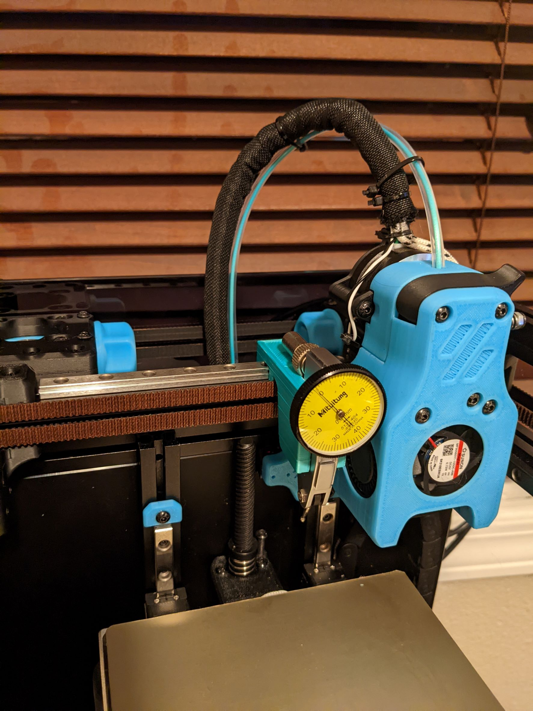
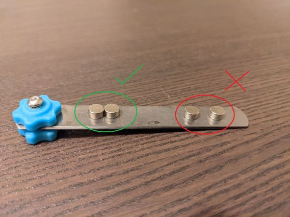
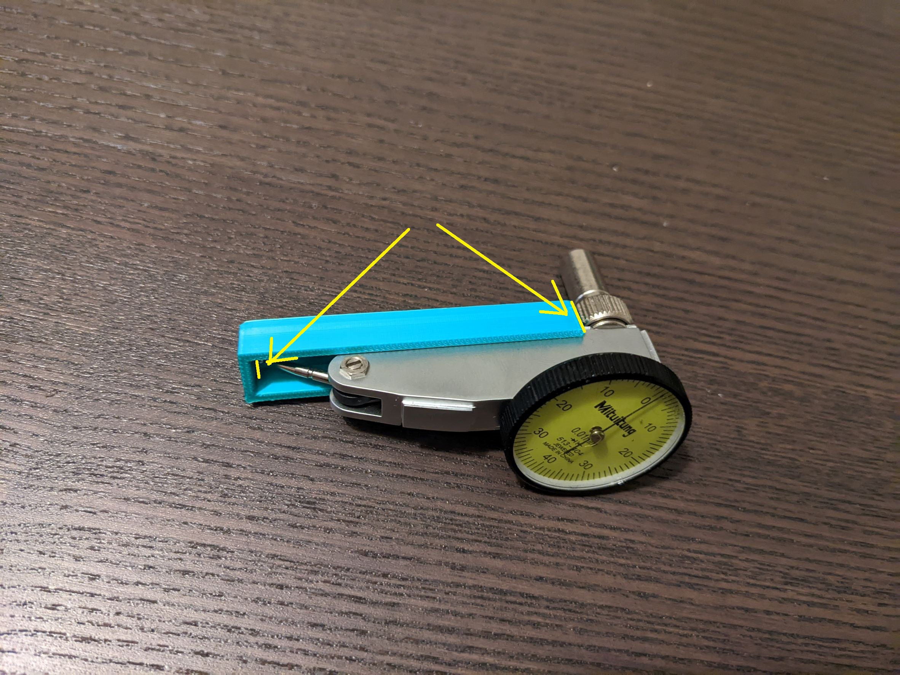

# Voron 0.1 Dial Indicator Mount



This project is an attempt to find a better way to level the bed that met a few key criteria:

1. No modifications to the printer
2. Keeping the same printable area
3. Repeatable and consistent results
3. Able to probe directly over each adjustment screw
4. Easy/inexpensive to build

We can achieve this by mounting a cheap dial test indicator directly to the Y linear rail.  Using magnets to secure it in place means we can center the indicator at virtually any spot on the bed.


## Disclaimer

Since the mount is not rigidly fixed to the frame or toolhead and we are relying on a friction fit, we can't use the dial gauge as it's intended to be used.  In a perfect world we would just need to roughly level the bed and zero the dial and then adjust all three screws until they match that zero.  In practice, the small amount of play means that if there's any pressure on the probe can move the mount itself and create inaccurate readings.

The only reliable way to get consistent (that I've found) is to move the bed until the exact point where the probe touches the bed.  The mount settles into a resting state and gives us consistent readings since we are just barely applying pressure.  Trying to measure two spots where the probe is already touching can have a variation in readings around +/-0.05mm, while letting the mount "rest" can get readings with +/-0.01mm (according to the dial)

We can still get great results with this modification and method, but it's important to know the limitations.

# BOM

* Dial_Gauge_Mount.stl
* (optional) Dial_Test_Setup_Guide.stl
* 4x - 6mm x 3mm magnets
* Dial Test Indicator - https://www.aliexpress.com/item/2251832796520415.html
* Metric Feeler Gauge Set
* Superglue

The optional print is to help adjust the angle of the Indicator's probe and the position of the dovetail clamp.  The Dial Test indicator itself doesn't need to be the exact one linked, a search for `Lever` or `Dovetail` should bring up the same yellow Chinese dial indicator.  Feeler gauge will be used to measure distances after the bed has been levelled. Superglue is to keep the magnets in place, there's extra clearance on the magnets to make sure they can be placed easily which also means they can be pulled out.

## Assembly

The only assembly for the printed part is installing the magnets with a drop of superglue.  Make sure the polarity is correct.  If you set them flat next to each other on a screwdriver/calipers none of the magnets should try to push away.



## Adjusting the Dial Indicator

THe mount was designed to have the tip of the probe lined up with the back edge of the Indicator, and to rest 1mmm lower than the nozzle to ensure we don't crash into the bed while levelling.  

The optional setup guide is designed to set the Indicator in with the back against the bottom, and the top hanging over the edge.  Adjust the probe so that it's almost touching the the corner.  Then attach the dovetail to the exposed back as far down as it will go without letting the probe touch the corner.



Before using the indicator for anything, make sure the dial is also rotated to 0 where it rests naturally.

Don't worry too much about accuracy here, the process laid out later on will adjust for any inconsistencies here.  As long as the angle is close and it's lower than the nozzle it's good to go.

# Macros

The last piece of setup is to add macros to the klipper configuration that will simplify the levelling process.  Here are the macros that will be added:

* `MANUAL_BED_LEVEL` - initializes the process to level each bed screw, sets `position_endstop` to 0.0, then moves to the first position.
* `MEASURE_OFFSET` - Intializes the process to measure the endstop offset at each screw, similar to `MANUAL_BED_LEVEL` but fixed at Z of 0.1mm
* `NEXT_Z` - Cycles through each of the bed level screws for both `MANUAL_BED_LEVEL`.  Uses the configured screw positions with offsets that will let you slide the mount right up to the toolhead and have it sit above the screw.  Sets the Z height to the `indicator_offset` value
* `BOOP` - Moves the Z axis +0.1mm, pauses for 1 second, then moves -0.1mm. Used to determine the exact point the probe touches the bed.  Mostly here since it will add a button to the dashboard for easy access.
* `END_BED_LEVEL` - Resets the data for `NEXT_Z`. This isn't not strictly necessary but will stop that macro from running.
* `UPDATE_Z_OFFSET` - Combines the calculated `hotend_offset` and `squish_offset` and updates `position_endstop` to the new value.

At the top of your `printer.cfg` add this line
```py
[include dial_indicator.cfg]
```

Then create a new file named `dial_indicator.cfg` and paste this code
```py
[save_variables]
filename: ~/klipper_config/variables.cfg

[gcode_macro UPDATE_Z_OFFSET]
gcode:
  
  SET_GCODE_OFFSET Z={((svv.hotend_offset + svv.squish_offset) * -1) + printer.configfile.config["stepper_z"]["position_endstop"]|float}
  Z_OFFSET_APPLY_ENDSTOP
  SAVE_CONFIG  

[gcode_macro MANUAL_BED_LEVEL]
gcode:
  
      G28
  
  SET_GCODE_OFFSET Z={printer.configfile.config["stepper_z"]["position_endstop"]|float}
  Z_OFFSET_APPLY_ENDSTOP
  SET_GCODE_OFFSET Z=0 MOVE=1
  
  SET_GCODE_VARIABLE MACRO=NEXT_Z VARIABLE=mode VALUE="level"
  SET_GCODE_VARIABLE MACRO=NEXT_Z VARIABLE=screw VALUE=1
  SET_GCODE_VARIABLE MACRO=NEXT_Z VARIABLE=z VALUE='{svv.indicator_offset}'
  NEXT_Z

[gcode_macro MEASURE_OFFSETS]
  
    G28
  
  SET_GCODE_VARIABLE MACRO=NEXT_Z VARIABLE=mode VALUE="measure"
  SET_GCODE_VARIABLE MACRO=NEXT_Z VARIABLE=screw VALUE=1
  SET_GCODE_VARIABLE MACRO=NEXT_Z VARIABLE=z VALUE=0.1
  NEXT_Z

[gcode_macro NEXT_Z]
variable_mode: ""
variable_screw: 0
variable_z: 0.0
gcode:
  
    {action_raise_error("Must use MANUAL_BED_LEVEL or MEASURE_OFFSETS to begin")}
  
  
  
  
  

  
    
    
      
    
      
    
  

  G90
  G0 X{x} Y{y} Z{z} F3000

  
    
  
    
  
  SET_GCODE_VARIABLE MACRO=NEXT_Z VARIABLE=screw VALUE={screw}

[gcode_macro END_BED_LEVEL]
gcode:
  SET_GCODE_VARIABLE MACRO=NEXT_Z VARIABLE=screw VALUE=0

[gcode_macro BOOP]
gcode:
  G91
  G0 Z0.1
  G4 P1000
  G0 Z-0.1
  G90

```

Create another new file named `variables.cfg`.  If you already have a file to store variables, add the values below to it and remove the reference at the top of your new `dial_indicator.cfg`
```python
[Variables]
indicator_offset = 1.00
hotend_offset = 0.20
squish_offset = 0.03
```

# Levelling Process

>The process below will refer to `BOOP` tests.  This means running the `BOOP` macro and looking for specific behavior on the indicator's dial to see if we need to move the bed up or down.  During the first move away from the bed we want to see the dial make a big jump and drop immediately to 0.  On the second move toward the bed we want to see the dial barely move or no movement at all.  If the dial never moves the bed is too low. If the dial never falls back to 0 or ends at >1 the bed is too high.  Yes, the name is also a little silly.  You can change it if you want, but I'm leaving it.

As with any other bed levelling, make sure to preheat the hotend and bed to the temperature you most commonly print at. If there's anything on the nozzle, do a small retraction to stop oozing and clean off stuck on filament.

## Finding `indicator_offset`

The first step is determing what our `indicator_offset` should be.  This is distance between the 0 from the Z Endstop and the tip of the indicator's probe.

1. If the bed is not already roughly level, level the bed using `BED_SCREWS_ADJUST` and paper/feeler gauge as you normally would.
2. Run `MANUAL_BED_LEVEL` to move to the front bed screw, then attach the mount above it.  Make sure it's fitting securly and not resting on the toolhead.
3. Increase the Z Height in +0.1mm increments until the dial reads 0.  It may take a few revolutions before it stops moving.
4. Lower the Z Height in -0.1mm increments until you see movement on the dial.
5. Move back up 0.1mm to the spot before any movement was seen
6. Babystep in -0.005mm increments until you find the height that passes a `BOOP` test
5. Update `indicator_offset` in `variables.cfg` to whatever the current Z Height is, then save and reboot.


## Levelling the Bed

The value we just found gives us a Z coordinate that we can level the bed against that's as close to the rough level that we started with using `BED_SCREWS_ADJUST`
Now that we have a rough idea of where the probe is in relation to the Z Endstop, we can start making adjustments to the  bed screws.

1. Run `MANUAL_BED_LEVEL` to start the levelling process.
2. Repeat `BOOP` tests and adjusting the bed screw as necessary until the first bed screw passes.  Be sure to remove your hand completely from the bed before each test.
3. Run `NEXT_Z` to cycle through the bed screws and repeat step 2 until you are happy with all three screws.
4. `END_BED_LEVEL` to reset the manual leveling status.  This is technically optional but prevents bed movement if you accidently execute `NEXT_Z` after finishing.

## Determining Final Offset

Now that we've got a level bed, the last step is to measure exactly how far away the nozzle is from 


1. Run the `BED_SCREWS_ADJUST` to begin cycling the hotend between the beds screws at 0 Z Height
2. From lowest to highest thickness, check feeler gauge blades underneath the hotend until one touches.
    * Tip: If you want to check a thickness between to blades, you may be able to combine two thinner blades to get an intermediate value
3. Save the thickness of the thinnest blade that touch the hotend
4. Repeat steps 2 and 3 for the remaining screws
    * The value should be the same or very close, but this helps double check that the bed is actually level
5. Update the `hotend_offset` in `variables.cfg` with the thickness from step 3
6. Run `UPDATE_Z_OFFSET` to update `printer.cfg` with your new value

Are you wondering "why are we using feeler gauge here, wasn't the whole point to use something better?" The problem with "paper" bed levelling (even with a more precise thickness) is the bed is only as level as our ability to feel consistent drag across all three screws. 

Checking depth as a simple pass/fail (either it touches the nozzle or it doesn't) eliminates that ambiguity.  And if we are confident that our bed is near-perfectly leveled, even if the true depth falls in the .01mm-0.03mm gap between some of the blades, we know that mistake will be the same across the bed and can be corrected by adjusting our offset.

## Squish Offset
 Setting the `squish_offset` in `variables.cfg` is completely optional.  It's an additional offset in case you're confident that you have the right `hotend_offset` but still want to make some small adjustments to help with first layer adhesion.  If you make a change to `squish_offset`, you just need to run `UPDATE_Z_OFFSET` to recalculate the Z `position_endstop` with the new combined value.